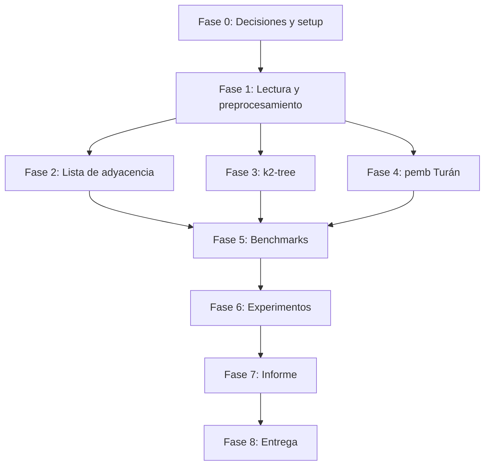

# Roadmap — Miniproyecto 2: Grafos Planares Compactos

Guía de trabajo derivada del [enunciado](ENUNCIADO.md). Marcar tareas al completarlas.

**Entrega:** 8 de julio (máx. 2 días de atraso, −0.5 décimas/día)  
**Nota total:** 7 pts → Código (2) + Evaluación experimental (3) + Informe (2)

**Datasets elegidos** (3/3 en `datasets/graphs/`):

| Grafo | Archivo | Vértices | Componentes |
|-------|---------|----------|-------------|
| Tiger Hawaii | `tiger_map_hawaii.pg` | 33,558 | **17** |
| Planar-1M | `planar_embedding1000000.pg` | 1,000,000 | 1 |
| World cities | `worldcitiespop.pg` | 2,243,467 | 1 |

---

## Resumen de entregables

| Entregable | Criterio rúbrica |
|------------|------------------|
| Código que compila, correcto y documentado | Código (2 pts) |
| Medición espacio + tiempos `degree` / `neighbors` en ≥3 grafos × 3 representaciones | Evaluación experimental (3 pts) |
| PDF: portada, descripción, implementaciones, análisis teórico + experimental | Informe (2 pts) |
| ZIP con fuentes + README replicable | Código + Informe |

---

## Fase 0 — Decisiones y setup del proyecto

> Bloquea todo lo demás. Hacer primero.

- [x] **0.1** Elegir versión k2-tree: **`k2tree_basic_v0.1` (Basic)** — decisión tomada
  - `k=2` fijo; un solo archivo `.kt`; build en un paso
  - API: `compact2CheckLinkQuery` (`neighbors`), `compact2AdjacencyList` (`degree`)
  - **Quick win (si da el tiempo):** comparar con hybrid en Hawaii — ver [§ Quick win hybrid](ROADMAP.md#quick-win-hybrid-opcional)
- [x] **0.2** Definir stack de build unificado
  - CMake raíz integra: C (`k2tree_basic`) + C++ (`sdsl-lite-turan`, `miniproyecto2`)
  - C++17, `RelWithDebInfo`, Apple Clang en macOS arm64
  - Hardware de referencia (registrado):
    - **Máquina:** MacBook Air 13" M4 2025, 16 GB RAM
    - **SO:** macOS Tahoe 26.5.1 (Darwin 25.5.0), arm64
    - **CPU:** Apple M4 (4P+6E) @ 4.46 GHz
    - **Compilador:** Apple Clang 21 (`clang++`)
- [x] **0.3** Limpiar scaffold miniproyecto 1 del repo raíz
  - Eliminados tests/benchmarks FM-Index; CMake y stubs MP2 en raíz
  - Scripts adaptados; `mp2_smoke` verifica build
- [ ] **0.4** Confirmar integrantes y actualizar README principal

**Criterio de done:** proyecto compila vacío; decisiones k2-tree documentadas.

---

## Fase 1 — Lectura y preprocesamiento de grafos

> Formato UdeC → estructuras internas. Parte evaluada explícitamente en enunciado.

### 1.1 Parser formato `.pg` (UdeC)

- [ ] **1.1.1** Integrar lector de grafos
  - Opción A: portar `udec-code/` (C) a módulo reutilizable
  - Opción B: usar `read_graph_from_file` de `sdsl-lite-turan/include/complementary/`
  - Validar contra ejemplo del enunciado (grafo 5 vértices / 7 aristas)
- [ ] **1.1.2** Tests de lectura sobre `tiger_map_hawaii.pg` (pequeño)
  - Verificar `n`, `m`, rango `[0, n-1]`, aristas duplicadas (u,v) y (v,u)

### 1.2 Componentes conexas

- [ ] **1.2.1** Implementar detección de componentes (BFS/DFS/Union-Find)
- [ ] **1.2.2** Particionar grafo en subgrafos por componente
  - Hawaii debe producir **17** componentes
  - Cada componente: renumerar vértices a `[0, n'-1]` si las librerías lo requieren
- [ ] **1.2.3** Tests: contar componentes en Hawaii; verificar que Planar-1M y World cities dan 1

### 1.3 Conversión a formato k2-tree

- [ ] **1.3.1** Implementar conversor UdeC → binario k2-tree:
  ```
  <n> <m> -1 <vecinos nodo 0> -2 <vecinos nodo 1> ...
  ```
  - Vecinos en orden creciente (o el orden que exija `build_tree`)
  - Índices **0 … n−1**
- [ ] **1.3.2** Validar conversión: reconstruir o comparar grado/adjacencia en grafo chico
- [ ] **1.3.3** Pipeline por componente: un `.pg` multi-componente → N archivos binarios k2-tree

**Criterio de done:** leer los 3 `.pg`, particionar Hawaii en 17, generar binarios k2-tree válidos.

---

## Fase 2 — Lista de adyacencia (implementación propia)

> Baseline clásico. **Implementación nuestra**, no viene del curso.

- [ ] **2.1** Diseñar estructura
  - `vector<vector<uint32_t>>` o arrays compactos `offsets[] + neighbors[]`
  - Construir desde formato UdeC o desde `Graph` de complementary
- [ ] **2.2** Implementar operaciones requeridas
  - `degree(v)`: tamaño de lista de adyacencia de `v`
  - `neighbors(u, v)`: `true` si existe arista `{u,v}` (búsqueda en lista de `u` o set auxiliar)
- [ ] **2.3** Implementar medición de espacio
  - Bytes totales: estructura + listas (definir fórmula y documentarla)
  - Ejemplo: `n * sizeof(offset) + 2m * sizeof(vertex_id)` para grafo no dirigido
- [ ] **2.4** Tests de correctitud
  - Comparar `degree(v)` y `neighbors(u,v)` contra brute-force del `.pg` en Hawaii
  - Muestreo aleatorio en Planar-1M

**Criterio de done:** lista de adyacencia correcta; espacio reportable en bytes.

---

## Fase 3 — Integración k2-tree **Basic**

> Implementación: [`k2tree_basic_v0.1/`](k2tree_basic_v0.1/). Hybrid solo como quick win opcional.

- [ ] **3.1** Compilar `k2tree_basic_v0.1`
  - Resolver warnings/errores en macOS arm64; documentar parches en informe
- [ ] **3.2** Pipeline construcción
  - `build_tree <GRAPH_binario> <basename>` → genera `<basename>.kt`
  - `max_level` se calcula automáticamente (`floor(log₂ n)`)
  - Probar primero en Hawaii (componente pequeña o grafo completo)
- [ ] **3.3** Wrapper C/C++ con API unificada
  - `degree(v)`: `compact2AdjacencyList(rep, v)` → `listady[0]`
  - `neighbors(u, v)`: `compact2CheckLinkQuery(rep, u, v)`
  - Cargar con `loadRepresentation(basename)` (añade `.kt` internamente)
- [ ] **3.4** Medición de espacio k2-tree
  - Tamaño archivo `.kt` por componente (+ overhead en RAM si aplica)
  - Sumar por dataset (Hawaii: 17 componentes)
- [ ] **3.5** Tests de correctitud vs lista de adyacencia
  - Muestra de pares `(u,v)` y vértices `v` en Hawaii

**Criterio de done:** k2-tree Basic construido para los 3 datasets; `degree` y `neighbors` coinciden con baseline en tests.

### Quick win hybrid (opcional)

Solo si Fases 0–6 con Basic están estables y queda tiempo antes del 8 julio.

- [ ] **QW.1** Compilar `k2tree_v0.2` y correr en **Hawaii** (1–2 componentes o grafo completo)
  - Parámetros: `K1=4`, `K2=2`, max level `5`, `S=22`, hash `4000000`
- [ ] **QW.2** Tabla comparativa Basic vs Hybrid: espacio (`.kt` vs `.tr+.lv+.cil+.voc`) y tiempos `neighbors`
- [ ] **QW.3** Párrafo en informe: trade-off simplicidad (Basic) vs compresión (Hybrid)

**No bloquea entrega.** Si no se alcanza, informe usa solo Basic y justifica la elección (recursos, grafos planares, pipeline simple).

---

## Fase 4 — Integración Extensión de Turán (`pemb.hpp`)

- [ ] **4.1** Compilar `sdsl-lite-turan` como dependencia
  - Integrar en CMake; resolver dependencias (`libstdc++`, etc.)
- [ ] **4.2** Construir `pemb<>` desde `Graph` (embedding planar del `.pg`)
  - Un `pemb` por componente conexa
- [ ] **4.3** Wrapper operaciones
  - `degree(v)`: `pe.degree(v)` (nativo en pemb)
  - `neighbors(u, v)`: recorrer vecinos con `first(v)` + `next()` + `vertex(e)` hasta encontrar `u`, **o** implementar helper `adjacent(u,v)` documentado
- [ ] **4.4** Medición de espacio: `sdsl::size_in_bytes(pe)` por componente
- [ ] **4.5** Tests de correctitud vs lista de adyacencia (Hawaii + muestra en grafos grandes)

**Criterio de done:** pemb operativo en los 3 datasets; operaciones validadas.

---

## Fase 5 — Framework de benchmarks

> Requisitos exactos del enunciado para tiempos.

### Parámetros fijos (documentar en informe)

| Parámetro | Valor enunciado | Nuestro valor |
|-----------|-----------------|---------------|
| Consultas por medición | 1000 | 1000 |
| Repeticiones por experimento | ≥ 30 | 30 |
| Operaciones | `degree(v)`, `neighbors(u,v)` | idem |

- [ ] **5.1** Generador de queries reproducible
  - Semilla fija (`std::mt19937`)
  - Criterio: vértices uniformes en `[0, n-1]`; pares `(u,v)` uniformes
  - Mismo set de queries para las 3 representaciones (comparación justa)
- [ ] **5.2** Medición de tiempo por operación
  - Acumular tiempo de 1000 llamadas → dividir por 1000 → tiempo promedio por consulta
  - Usar `std::chrono::high_resolution_clock` o equivalente
  - Repetir 30 veces → promedio ± desviación (o intervalo)
- [ ] **5.3** Medición de espacio
  - Tabla: grafo × representación × bytes (y por componente si aplica)
  - Incluir tiempo de construcción (opcional pero útil para informe)
- [ ] **5.4** Exportar resultados a CSV en `results/`
  - Columnas sugeridas: `graph`, `representation`, `component_id`, `n`, `m`, `space_bytes`, `operation`, `avg_time_us`, `std_time_us`, `repetitions`
- [ ] **5.5** Script `execute_benchmarks.sh` que corra todo el pipeline
- [ ] **5.6** Script `plot.sh` + gnuplot para gráficos del informe

**Criterio de done:** un comando reproduce todos los experimentos del enunciado.

---

## Fase 6 — Experimentos completos

### Por cada grafo × cada representación × cada componente

- [ ] **6.1** Tiger Hawaii — 17 componentes × 3 representaciones
  - Espacio total y por componente
  - Tiempos `degree` y `neighbors`
- [ ] **6.2** Planar-1M — 1 componente × 3 representaciones
- [ ] **6.3** World cities — 1 componente × 3 representaciones

### Validación cruzada

- [ ] **6.4** Verificar que resultados de `neighbors(u,v)` son idénticos entre las 3 representaciones (misma muestra de queries)
- [ ] **6.5** Verificar que `degree(v)` coincide entre las 3 representaciones

### Análisis (para informe)

- [ ] **6.6** Tabla comparativa de espacio (¿cuántas veces más chico que lista de adyacencia?)
- [ ] **6.7** Tabla/gráficos de tiempos (trade-off espacio vs tiempo)
- [ ] **6.8** Discutir impacto de componentes múltiples (Hawaii)
- [ ] **6.9** Reportar parámetros k2-tree usados y por qué

**Criterio de done:** todos los experimentos del enunciado ejecutados; CSVs y gráficos listos.

---

## Fase 7 — Informe PDF

Estructura obligatoria según enunciado:

- [ ] **7.1** Portada (integrantes, curso, fecha)
- [ ] **7.2** Descripción de la tarea
- [ ] **7.3** Descripción de implementaciones
  - Lista de adyacencia (propia)
  - k2-tree (versión, parámetros, adaptaciones de compilación/formato)
  - Extensión de Turán (`pemb`)
  - Pipeline de lectura, componentes conexas, conversión k2-tree
- [ ] **7.4** Análisis teórico
  - Espacio asintótico / empírico de cada representación
  - Complejidad de `degree` y `neighbors`
  - Fuentes: paper pemb ([arXiv:1610.00130](https://arxiv.org/abs/1610.00130)), paper k2-tree (Brisaboa et al., *Information Systems* 2014), material-base docs
  - Apuntes del curso: **opcionales** — solo si quieren alinear redacción con lo visto en clase
- [ ] **7.5** Análisis experimental
  - Setup (hardware, datasets, parámetros, metodología de medición)
  - Tablas y gráficos
  - Conclusiones: ¿compactas valen la pena? ¿en qué casos?
- [ ] **7.6** Problemas encontrados y soluciones (obligatorio por enunciado)
- [ ] **7.7** Referencias a archivos del ZIP de entrega

**Criterio de done:** PDF autocontenido; revisor entiende la solución sin mirar código.

---

## Fase 8 — Paquete de entrega

- [ ] **8.1** README raíz con instrucciones de replicación
  ```bash
  ./initialize_project.sh   # o equivalente
  ./execute_benchmarks.sh
  ./plot.sh
  ```
- [ ] **8.2** Documentar cada archivo/directorio relevante
- [ ] **8.3** ZIP con todo el código fuente (sin datasets de 273 MB si no caben — indicar cómo descargarlos)
- [ ] **8.4** Revisión final: compila en máquina limpia

---

## Mapa de dependencias



---

## Orden de trabajo sugerido (sprints)

| Sprint | Foco | Duración estimada |
|--------|------|-------------------|
| ~~**S0**~~ | ~~Fase 0: CMake, limpieza MP1, stubs, smoke test~~ | ✅ hecho |
| **S1** | Fase 1.2: componentes conexas Hawaii | 1–2 días |
| **S2** | Fase 2 (lista adyacencia) + tests correctitud | 1 día |
| **S3** | Fase 1.3 + Fase 3 (k2-tree compila y funciona en Hawaii) | 1–2 días |
| **S4** | Fase 4 (pemb en Hawaii + grafos grandes) | 1–2 días |
| **S5** | Fase 5 + Fase 6 (benchmarks completos, CSVs, gráficos) | 1–2 días |
| **S6** | Fase 7 + Fase 8 (informe + ZIP) | 1–2 días |
| **S7** *(opcional)* | Quick win hybrid en Hawaii + tabla comparativa | 0.5–1 día |

---

## Decisión k2-tree

| | |
|---|---|
| **Principal** | Basic (`k2tree_basic_v0.1`) — pipeline completo en 3 grafos |
| **Quick win** | Hybrid (`k2tree_v0.2`) solo en Hawaii si da el tiempo — comparación espacio/tiempo para informe |
| **Justificación Basic** | Menos RAM/disco, un paso de build, un `.kt`, grafos planares con grado bajo, deadline ajustado |

---

## Material ya disponible vs pendiente

### ✅ Listo (`material-base/`)

- Enunciado, docs k2-tree y Turán
- `k2tree_v0.2/`, `k2tree_basic_v0.1/`
- `sdsl-lite-turan/` con `pemb.hpp`
- `udec-code/` (read/write grafos)
- 3 grafos `.pg` en `datasets/graphs/`

### ❌ Falta (de implementar o aportar)

| Item | Fase |
|------|------|
| Lista de adyacencia propia | 2 |
| ~~Decisión k2-tree~~ | ✅ Basic (+ hybrid opcional) |
| Conversor UdeC → binario k2-tree | 1.3 |
| Partición componentes conexas | 1.2 |
| Wrappers unificados + benchmarks | 3–5 |
| Apuntes teóricos del curso | 7.4 |
| Hardware / integrantes confirmados | 0, 7 |

---

## APIs de referencia rápida

| Operación | Lista adyacencia | k2-tree **Basic** | k2-tree hybrid *(QW)* | pemb (Turán) |
|-----------|------------------|-------------------|----------------------|--------------|
| `degree(v)` | `adj[v].size()` | `compact2AdjacencyList` → `[0]` | `compactTreeAdjacencyList` | `pe.degree(v)` |
| `neighbors(u,v)` | buscar en `adj[u]` | `compact2CheckLinkQuery` | `compactTreeCheckLink` | recorrer vecinos |
| Espacio | calcular manual | `.kt` | `.tr+.lv+.cil+.voc` | `size_in_bytes(pe)` |

---

## Checklist rápido pre-entrega

- [ ] ≥ 3 grafos medidos
- [ ] 3 representaciones en cada grafo
- [ ] Componentes conexas separadas (Hawaii)
- [ ] Espacio reportado
- [ ] `degree` y `neighbors` cronometrados (1000 ops, /1000, ×30 repeticiones)
- [ ] Parámetros k2-tree en informe
- [ ] Problemas de integración documentados
- [ ] PDF + ZIP con README
